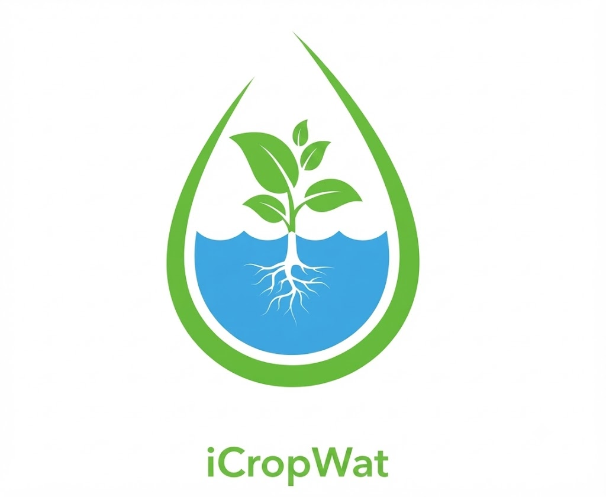
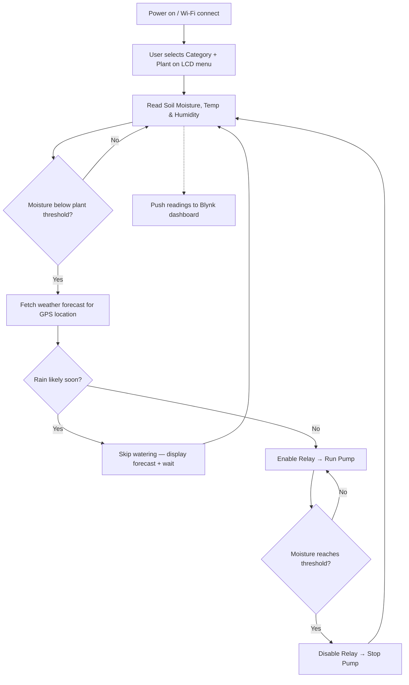
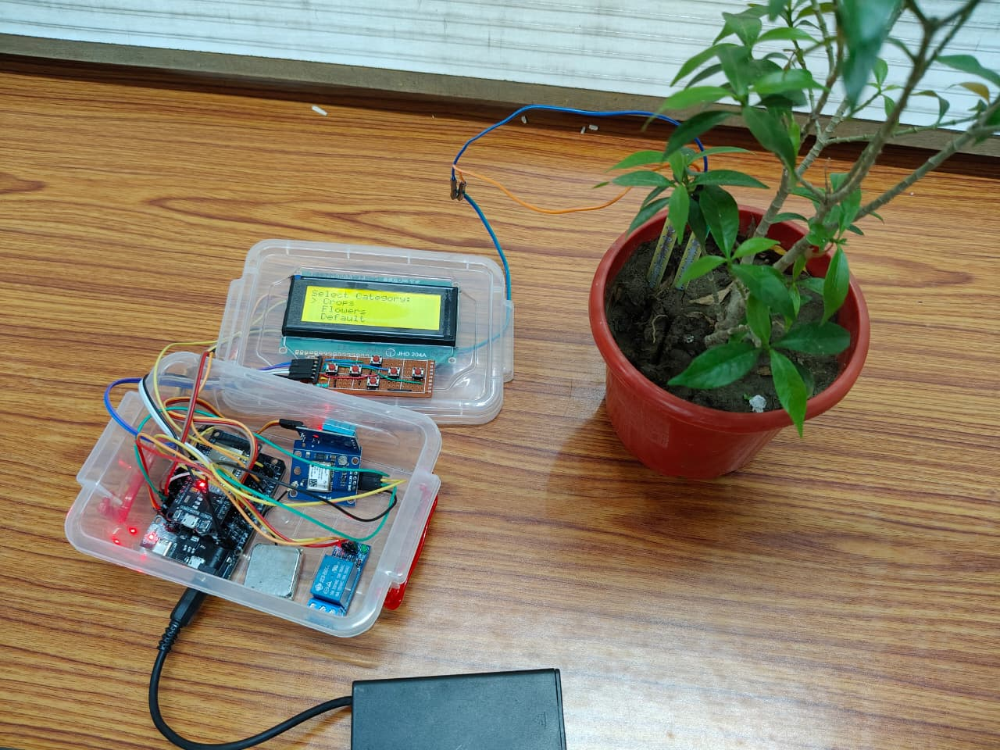
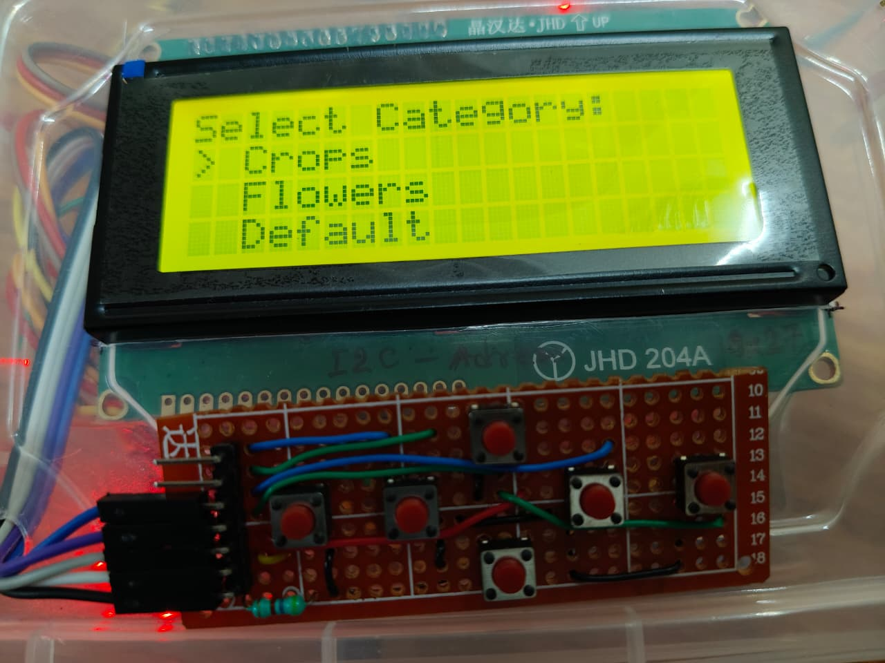
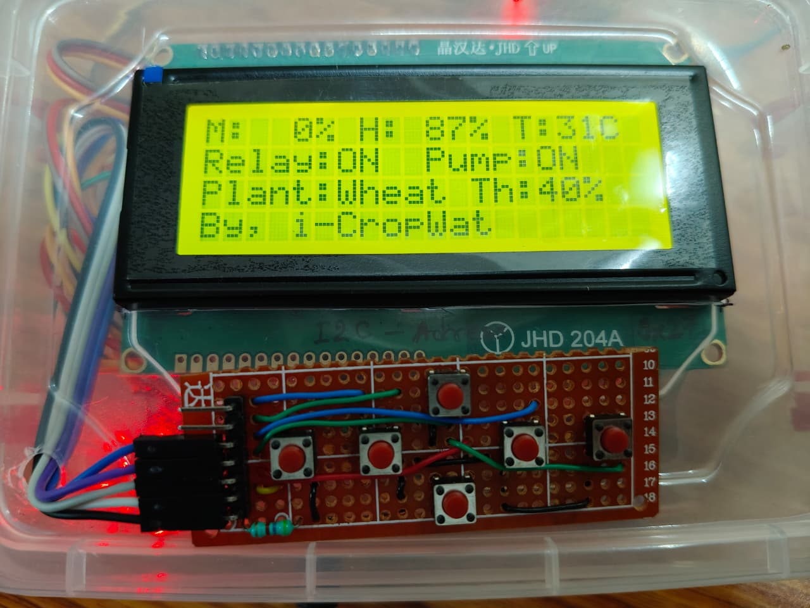
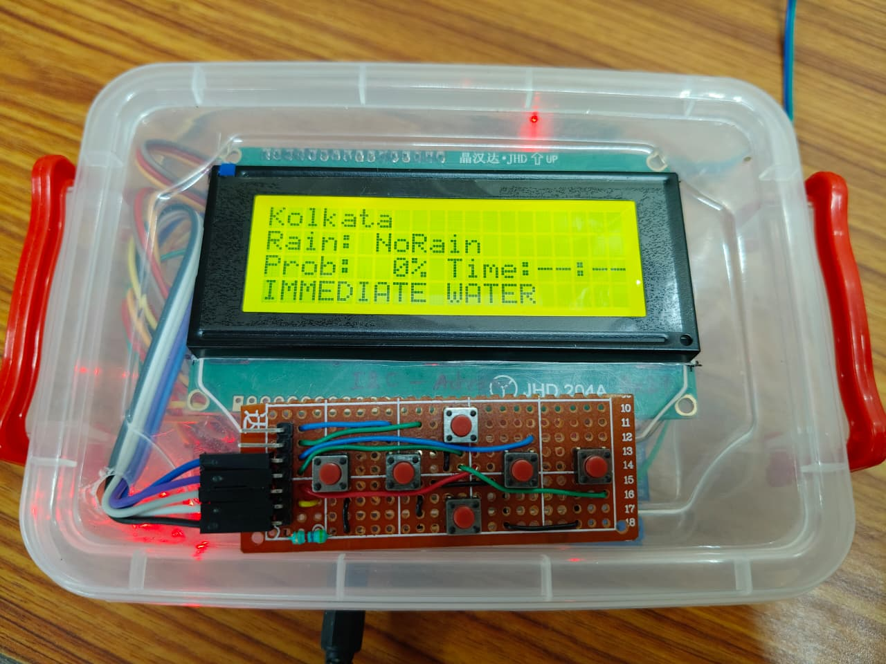

<div align="center">



<h2><font color="#4DBD33">iCropWat</font></h2>


### Weather-Aware Smart Irrigation for Real Farms and Real Gardens

*An ESP32-based irrigation controller that reads the soil before it acts and checks the sky before it waters.*

[](https://www.espressif.com/)
[](https://en.wikipedia.org/wiki/C%2B%2B)
[](https://blynk.io/)
[]()
[](#-license)

</div>

---

## 📖 Overview

**i-CropWat** is a self-contained irrigation controller built around an **ESP32**. Instead of watering on a fixed timer, it makes each watering decision from two live inputs: the **soil moisture sensor in the pot**, and a **weather forecast pulled from the internet for the device's own GPS location**. If the soil is dry but rain is on the way, the pump stays off — the system waits instead of wasting water.

Everything is operated from an on-board **20×4 I2C LCD and a 5-button keypad**, so a plant or crop type can be selected on the device itself, with no laptop or re-flashing required. Live readings and irrigation events are also mirrored to a phone over the **Blynk** IoT platform, so the setup can be checked on remotely.

This repository documents a **working prototype**, built and tested by two IT-department students at MCKV Institute of Engineering as a college project — every feature listed below is implemented and running on the hardware shown in the [gallery](#-prototype-gallery).

---

## 🧩 The Problem It Addresses

| Problem | How it shows up in practice |
|---|---|
| 💧 **Water wastage** | Timer-based systems water on a schedule, not on need — often right before or during rain |
| 🧳 **Neglect during absence** | Manual watering fails the moment nobody is around to do it |
| 🌿 **Guesswork over data** | Growers rely on touch-and-feel for soil moisture instead of a measured value |
| ⚡ **All-or-nothing automation** | Most low-cost setups can't tell *when* to skip a watering cycle, only *whether* a pump exists |

i-CropWat's answer to this is a small decision engine that sits between the sensors and the pump — described below.

---

## ✨ Key Features

- **🧠 Weather-Aware Decisions** — Before triggering a scheduled watering, the ESP32 calls a weather API for the device's GPS-derived location and checks the rain probability. A likely rain event postpones watering.
- **🌾 Plant-Specific Moisture Thresholds** — Each plant profile (e.g. Wheat) carries its own "water when below X% moisture" threshold, shown live on the LCD as `Th: XX%`.
- **🖥️ On-Device Menu System** — A 20×4 LCD + 5-button keypad lets the user pick a **Category** (`Crops` / `Flowers` / `Default`) and then a specific plant, entirely offline.
- **📟 Live Status Display** — A single screen shows soil moisture, humidity, temperature, relay/pump state, selected plant, and its threshold in one glance (`M:`, `H:`, `T:`, `Relay:`, `Pump:`, `Plant:`, `Th:`).
- **🌦️ Forecast Readout on the Device** — A dedicated screen shows the resolved city, rain status, rain probability, and forecast time window, alongside an `IMMEDIATE WATER` flag when action is required right now.
- **🚨 Safety Cutoffs** — Watering starts automatically when soil moisture falls below the plant's threshold, and stops automatically once the target is met — protecting against both underwatering and waterlogging.
- **📱 Remote Monitoring via Blynk** — Soil moisture, temperature, and humidity are pushed to the Blynk app for off-site monitoring.
- **🔘 Manual Override** — Physical buttons allow re-selecting a plant/category or resetting the current cycle without touching the code.


---

## ⚙️ How It Works



**In short:** dry soil is necessary but not sufficient to trigger the pump — the forecast has to agree first, unless moisture drops to a critical level that calls for immediate watering regardless.

---

## 🛠️ Hardware Architecture

### Components Required

| Component | Budget (Est.) | Function |
| :--- | :--- | :--- |
| **NodeMCU – ESP 32** | ₹250 | The brain of the system (Wi-Fi + Processing) |
| **Soil Moisture Sensor** | ₹35 | Measures volumetric water content in soil |
| **Mini Micro Pump DC (3-6V)** | ₹60 | Delivers water to the plant roots |
| **Solid State Relay (SSR)** | ₹45 | Controls the high-power water pump |
| **DHT11 Sensor** | ₹50 | Measures ambient Temperature and Humidity |
| **LCD Display (I2C)** | ₹120 | Displays status, menu, and weather data |
| **Power Supply/Battery** | ₹100 | Powers the microcontroller and pump |
| **Connecting Wires** | ₹65 | System integration |
| **Others** | ₹70 | Enclosure and misc. hardware |
| **Total** | **~₹795** | |


---

## 💻 Software Stack

| Layer | Choice |
|---|---|
| Firmware language | C++ (Arduino framework) |
| Networking | `WiFi.h`, `HTTPClient.h` |
| Data parsing | `ArduinoJson.h` (weather API responses) |
| Display | `LiquidCrystal_I2C.h` |
| Sensing | `DHT.h` |
| Remote monitoring | `BlynkSimpleEsp32.h` |
| Forecast source | Weather API (queried using GPS-resolved coordinates) |

---

## 🖼️ Prototype Gallery

<div align="center">

<a name="img-1"></a>
<br/>
<sub><b>1 / 4 — Full Assembly.</b> Controller enclosure wired to the soil probe inserted directly into the potted plant.</sub>

<p><a href="#img-4">⬅ Prev</a> &nbsp;•&nbsp; <a href="#img-2">Next ➡</a></p>

<br/>

<a name="img-2"></a>
<br/>
<sub><b>2 / 4 — Category Menu.</b> On-device selection screen (<code>Crops</code> / <code>Flowers</code> / <code>Default</code>) driven by the 5-button keypad.</sub>

<p><a href="#img-1">⬅ Prev</a> &nbsp;•&nbsp; <a href="#img-3">Next ➡</a></p>

<br/>

<a name="img-3"></a>
<br/>
<sub><b>3 / 4 — Live Status Screen.</b> Soil moisture, humidity, temperature, relay/pump state, selected plant, and its moisture threshold, all in one view.</sub>

<p><a href="#img-2">⬅ Prev</a> &nbsp;•&nbsp; <a href="#img-4">Next ➡</a></p>

<br/>

<a name="img-4"></a>
<br/>
<sub><b>4 / 4 — Forecast Screen.</b> Resolved location, rain status, rain probability, and an <code>IMMEDIATE WATER</code> flag for time-critical decisions.</sub>

<p><a href="#img-3">⬅ Prev</a> &nbsp;•&nbsp; <a href="#img-1">Next ➡</a></p>

</div>

> GitHub-flavored Markdown does not execute JavaScript, so a true sliding carousel can't run natively in this file. The anchors above give left/right-style navigation by jumping directly to each image — the closest GitHub-native equivalent to arrow controls.

<details>
<summary><b>📸 Quick-scan grid (all four side by side)</b></summary>
<br/>

| Full Assembly | Category Menu | Live Status | Forecast Screen |
|:---:|:---:|:---:|:---:|
|  |  |  |  |

</details>

### Required folder structure for the images above

```
i-CropWat/
├── README.md
└── assets/
    ├── prototype-1.jpg   # Full hardware assembly next to the plant
    ├── prototype-2.jpg   # LCD — category selection menu
    ├── prototype-3.jpg   # LCD — live sensor & irrigation status
    └── prototype-4.jpg   # LCD — weather forecast + IMMEDIATE WATER flag
```

Place your four prototype photos in an `assets/` folder at the repo root using the exact filenames above (or update the `src` paths in the gallery section to match your own names).

---

## 🔌 Hardware + Software Kickoff

**1. Clone the Repository**

```bash
git clone https://github.com/mukherjeesuchetana514-maker/i-CropWat.git
```

**2. Wire Up the Hardware**
- Connect the **Soil Sensor** signal pin to `GPIO 34`.
- Connect the **DHT11** data pin to `GPIO 4`.
- Connect the **Relay** control pin to `GPIO 5`.
- Wire the **Keypad** to `GPIO 12` (Menu), `GPIO 14` (Up), `GPIO 26` (Down), `GPIO 25` (Select).

**3. Add Your Credentials**
- Open `i_Cropwat.ino` in the Arduino IDE.
- Replace the placeholder values below with your own Wi-Fi, Blynk, and weather-API keys before flashing:

```cpp
char   BLYNK_AUTH[]   = "YOUR_BLYNK_AUTH_TOKEN";
const char* WIFI_SSID = "YOUR_WIFI_NAME";
const char* WIFI_PASS = "YOUR_WIFI_PASSWORD";
const char* OWM_APIKEY = "YOUR_WEATHERAPI_KEY";
```

**4. Flash the Board**
- Board: `DOIT ESP32 DEVKIT V1`
- Select the correct port, then **Upload**.

---

## 📲 Usage

1. Power on the device — it connects to Wi-Fi and resolves its GPS location.
2. Use the **Menu/Up/Down/Select** buttons to choose a **Category** and then a specific **Plant**.
3. The LCD switches to the **live status screen**, cycling with the **forecast screen** as needed.
4. When soil moisture drops below the selected plant's threshold, the system checks the forecast:
   - **Rain expected →** watering is deferred, and the screen shows the forecast reason.
   - **No rain expected →** the relay engages and the pump runs until the threshold is met.
5. Open the Blynk app to monitor moisture, temperature, and humidity remotely.

---

## 🔮 Future Scope

- 🔧 Move from breadboard/prototype wiring to a custom PCB
- 💰 Swap to retail-grade components to bring per-unit cost down for wider distribution
- 🌆 Adapt thresholds and enclosure design for balcony and community/vertical gardens
- 🌐 Multilingual support on-device and in a companion app
- 📶 Explore LoRa/NB-IoT for sites with poor Wi-Fi coverage
- 📱 Build a dedicated mobile/web app to eventually replace the Blynk dependency

---

## 👥 Team

**Built by IT-department students at MCKV Institute of Engineering:**

| Name | Roll |
|---|---|
| Sukanya Rana | BTECH/IT/24/087 |
| Suchetana Mukherjee | BTECH/IT/24/074 |


** Project Supervisor:** Mr. Mojammel Rahaman, Assistant Professor, Dept. of Basic Science & Humanities, MCKVIE

---

## 📄 License

Released under the [MIT License](LICENSE) — feel free to fork, adapt, and build on this project with attribution.

<div align="center">

*Built to make every watering cycle count.* 🌾

</div>
